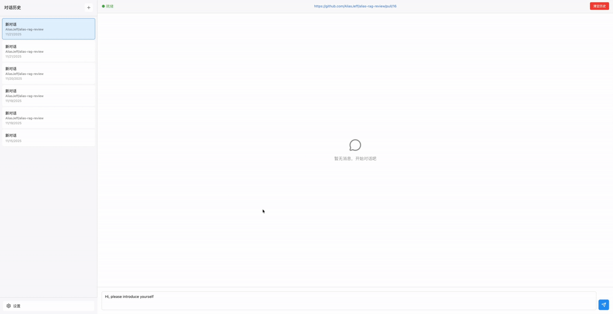
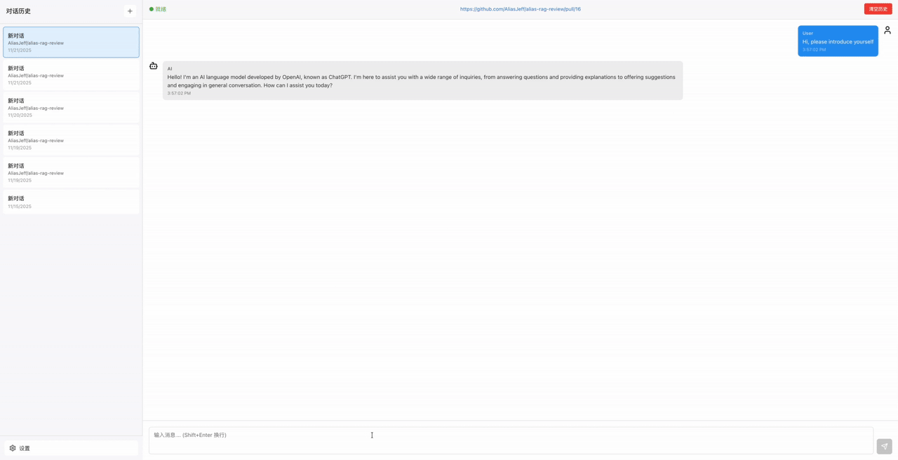

# alias-rag-review

A comprehensive AI-powered code review and knowledge management system combining Retrieval-Augmented Generation (RAG) with OpenAI integration.

## 🎯 Project Overview

- **AI RAG Knowledge** (`ai-rag-knowledge/`): A RAG system for indexing and retrieving code context
- **OpenAI Code Review** (`openai-code-review/`): AI-powered code review engine with conversation management
- **OpenAI Frontend** (`openai-frontend/`): Modern React-based web interface for interactive code review

## 🔑 Key Features

1. **Conversation Management**
2. **Real-time Streaming**



3. **Code Context Retrieval**
4. **Intelligent Code Review & Comments on PR**




## 🚀 Quick Start

### Prerequisites

- Java 17+
- Maven 3.8+
- Node.js 18+ (for frontend)
- OpenAI API key
- Git
- Docker

### Git Hooks

```bash
git config core.hooksPath .githooks
```

### Backend Setup

1. **Build all maven modules**

2. **Start environment using docker-compose**:

   ```bash
   cd dev-ops/
   docker-compose -f docker-compose-environment.yml up -d
   ```

### Frontend Setup

1. **Install dependencies**:

   ```bash
   npm install
   # or
   yarn install
   ```

2. **Configure environment variables**:

   ```bash
   cp .env.example .env.local
   # Edit .env.local with your API endpoints and keys
   ```

3. **Run development server**:

   ```bash
   npm run dev
   ```

   Access at `http://localhost:3000`

## 🏗️ Project Structure

```
alias-rag-review/
├── pom.xml                          # Root Maven configuration
├── eclipse-java-formatter.xml       # Code formatting rules
├── .githooks/                       # Git hooks (pre-commit)
│
├── ai-rag-knowledge/                # RAG System
│   ├── pom.xml
│   ├── rag-dev-tech-api/            # API interfaces
│   ├── rag-dev-tech-app/            # Spring Boot app
│   └── rag-dev-tech-trigger/        # Event triggers
│
├── openai-code-review/              # Code Review System
│   ├── pom.xml
│   ├── openai-code-review-api/      # Core interfaces
│   ├── openai-code-review-app/      # Spring Boot app
│   └── openai-code-review-trigger/  # REST controllers
│
└── openai-frontend/                 # React Frontend
    ├── package.json
    ├── src/
    │   ├── app/                     # Next.js pages
    │   ├── components/              # React components
    │   ├── services/                # API services
    │   ├── hooks/                   # Custom hooks
    │   └── types/                   # TypeScript types
    └── public/                      # Static assets
```

## 📄 License

This project is licensed under the Apache License 2.0 - see the [LICENSE](LICENSE) file for details.
